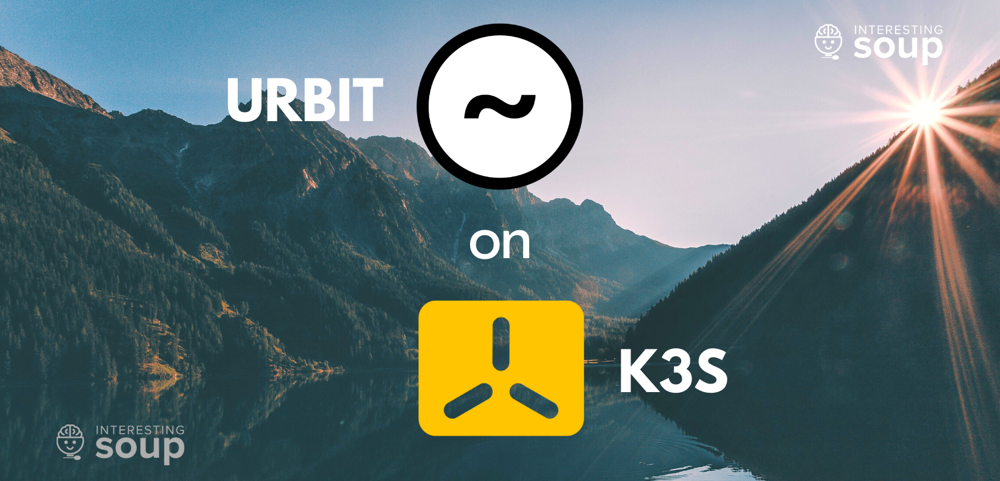

# urbit-k3s-rpi
## Urbit on K3S


[interestingsoup/urbit-aarch64](https://hub.docker.com/r/interestingsoup/urbit-aarch64) is the image used in this tutorial.
Learn more about why and how we made it [here](https://interestingsoup.com/how-to-create-a-dockerimage/)

This guide assumes you have:
- Setup a persistent volume and presistent volume claim for your Urbit pod. I am providing my pv.yaml and pvc.yaml as an example.
- Installed a LoadBalancer service on your cluster, I am using MetalLb. 

The docker image being used executes `urbit` upon running, so you only need to supply thr args.  When setting args in `*-planet.yaml` you may referrence the Urbit man page example:

```
Simple Usage:
   urbit -c <my-comet> to create a comet (anonymous urbit)
   urbit -w <my-planet> -k <my-key-file> if you own a planet
   urbit <my-planet or my-comet> to restart an existing urbit
```

## Deploy your Planet

### Initial Launch (First boot)
Modify `new-planet.yaml` with your information before running this command:

$kubectl apply -f new-planet.yaml -n urbit

You can check log output of the pod to see if any error occurs once the Urbit container is created:

	$kubectl logs <pod_name> -n urbit

**After your planet is successfully launched, the pod should error out. This is normal**

You can see your pod error by running: `kubectl get pods -A`

Once the pod errors out, you can go ahead and delete your deployment:

	$kubectl delete -f new-planet.yaml -n urbit

### Secondary Launch (to retrieve your planet's code)

Apply `no-planet.yaml` to launch your container without executing `urbit` command. 
This will just keep your pod in Running state, so that we can get shell access.

	$kubectl apply -f no-planet.yaml -n urbit

After the pod is in running status, you may run this command to open a empty shell:

	$kubectl exec -it  <pod_name> -n urbit -- /bin/sh

In the created SHELL, run urbit with your planet-name:
`urbit <planet-name>`

Once your planet is fully up, runnning, and you see `dojo`. 
You can run: 

	$+code

to get your planets access code. 
Please keep this in a safe spot as it's reusable.
CTRL-C or CTRL-D out of dojo and then the SHELL.

Now delete the deployment:

	$kubectl delete -f no-planet.yaml -n urbit

### Final Launch (restart your existing planet)
Lastly, apply `restart-planet.yaml` to restart an existing planet.

	$kubectl apply -f restart-planet.yaml -n urbit

You should now see your Urbit pod up and running: `kubectl get pods -A`.
You can see Urbit service has successfully started by view pod logs: `kubectl logs <pod_name> -n urbit`
In the pod logs look out for **live** and **ames** port that Urbit is using, you will use these ports in `service.yaml`

## Accessing Landscape

Apply `service.yaml` after you have configured it with your settings. I am using MetalLB as my LoadBalancer. 
It assigns an external IP to my service allowing it to be accessed outside the node. 
In `service.yaml` replace the target ports with ports you saw being used in `kubectl logs <pod_name> -n urbit` command 
from the previous step.

	$kubectl apply -f service.yaml -n urbit

Run `kubectl get svc -A` and look for the service that was created for Urbit. 
```
NAMESPACE       NAME                   TYPE           CLUSTER-IP      EXTERNAL-IP     PORT(S)                        AGE
urbit           urbit                  LoadBalancer   10.43.5.99      192.168.4.210   80:32432/TCP,38254:30582/TCP   19h
```

As you can see from my output above, I now have an ExternalIP assigned and if I go to that IP on any device on my network, I can access Urbit Landscape successfully.

## Questions
Urbit group: [🧠🥣InterestingSoup](web+urbitgraph://group/~togtun-pocres/brain-interestingsoup-bowl-with-spoon) <br>
Urbit DM: ~togtun-pocres <br>
Website: [InterestingSoup.com](https://interestingsoup.com) <br>
TikTok?! Why Not!: [@interestingsoup](https://www.tiktok.com/@interestingsoup) <br>

## Special Thanks To:
~nartec-tinrus: for working alongside me to create this and also supplying a planet to make testing easier!
